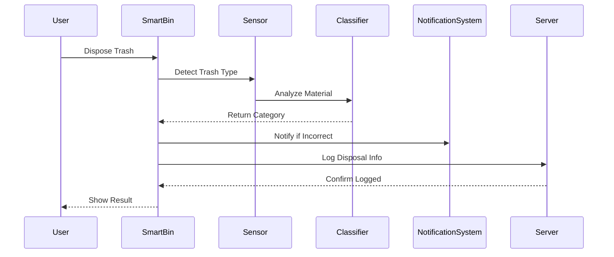

# ♻️ 스마트 분리수거 알림 시스템

## 📌 프로젝트 개요
일상 속 소프트웨어 활용 사례로, 사용자가 쓰레기를 스마트 분리수거함에 넣으면 자동으로 분류 및 알림을 처리하는 시스템입니다.

---

## 🧭 시퀀스 다이어그램



---

## 📂 파일 설명
- `main.py`: 실행 파일
- `smart_bin.py`: 스마트 쓰레기통 로직
- `sensor.py`: 감지기 모듈
- `classifier.py`: 쓰레기 분류기
- `notification.py`: 사용자 알림
- `server.py`: 서버 로그 기록

---

## 🧪 모듈 평가

**응집도 (Cohesion)**  
- 각 클래스는 하나의 기능에만 집중 → **높은 응집도**

**결합도 (Coupling)**  
- SmartBin이 모듈들을 조합하여 사용, 직접 연결 X → **낮은 결합도**

---

## ▶️ 실행 방법

```bash
python main.py
```

Python 3.x가 설치되어 있어야 합니다.
