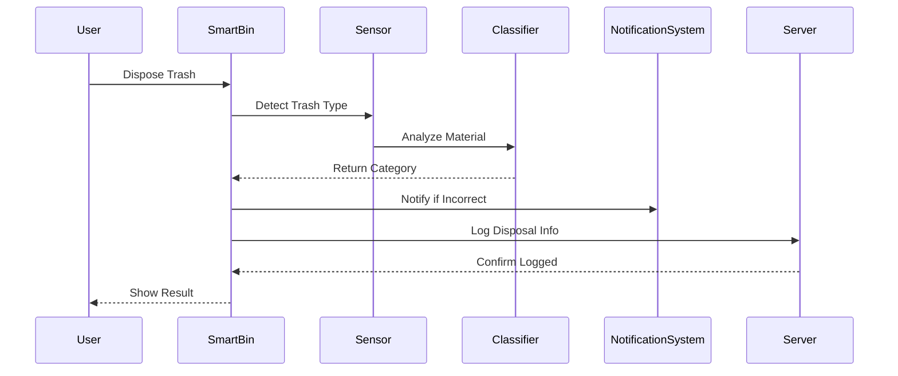

# ♻️ 스마트 분리수거 알림 시스템 (Smart Recycle Notifier)

## 📌 프로젝트 개요

이 프로젝트는 **일상 속 소프트웨어 사용 사례**로, 사용자가 **스마트 쓰레기통**에 쓰레기를 버릴 때 **자동으로 분류**하고, **분리수거 규칙에 어긋나는 경우 알림을 제공**하는 시스템입니다. 또한 **서버에 처리 이력을 기록**하여 향후 통계나 모니터링에 활용될 수 있습니다.

이 프로젝트는 소프트웨어 아키텍처 중 **시퀀스 다이어그램 기반 설계 → 모듈 구현 → 응집도/결합도 평가**까지 포함하는 학습 목적의 과제입니다.

---

## 🧭 시퀀스 다이어그램



---

## 🧱 시스템 구성요소 (모듈 설명)

| 모듈              | 역할 설명 |
|------------------|-----------|
| `main.py`        | 프로그램 실행 시 스마트빈 시뮬레이션을 시작합니다 |
| `smart_bin.py`   | 모든 기능을 통합하여 사용자 입력을 처리하는 중앙 허브 역할 |
| `sensor.py`      | 쓰레기의 물리적 특성을 감지하는 센서 역할 시뮬레이션 |
| `classifier.py`  | 감지된 데이터를 기반으로 쓰레기 종류를 분류합니다 |
| `notification.py`| 잘못된 분리수거일 경우 사용자에게 경고 메시지를 전송합니다 |
| `server.py`      | 분리수거 결과를 서버에 기록(로그 저장)합니다 |

---

## ▶️ 실행 방법

### 1. Python 실행 환경 준비
- Python 3.x 설치 필요
- 별도의 라이브러리 설치는 필요 없음

### 2. 실행 명령어
```bash
python main.py
```

---

## 🧪 모듈 평가 (상세)

### ✔ 응집도 (Cohesion)

응집도는 하나의 클래스 또는 모듈이 얼마나 **단일 책임(SRP)**을 잘 지키는지를 의미합니다.  
본 프로젝트에서는 다음과 같은 이유로 **높은 응집도**를 갖습니다:

- 각 클래스는 하나의 기능만을 수행합니다.
- 예: `Sensor`는 감지만, `Classifier`는 분류만 수행합니다.
- 모든 메서드는 해당 기능 수행에만 집중되어 있습니다.

🔎 예시:
```python
class Sensor:
    def detect(self):
        print("쓰레기 감지 중...")
        return "plastic"
```
→ 하나의 책임만 수행하는 구조로, **유지보수와 테스트가 용이**합니다.

---

### ✔ 결합도 (Coupling)

결합도는 클래스 간의 의존성 정도를 의미하며, 낮을수록 유지보수가 쉽습니다.

- `SmartBin`이 모든 하위 모듈을 제어하는 허브 역할을 하며, 각 모듈은 서로 직접 연결되지 않습니다.
- 각 모듈이 독립적으로 작동하며, **다른 모듈 교체 시 영향이 적음**.
- 이는 낮은 결합도를 의미합니다.

🔎 예시:
```python
material = self.sensor.detect()
category = self.classifier.classify(material)
```

→ 모듈 간 직접 호출 없이 SmartBin을 통해서만 통신하므로, **유연한 구조**입니다.

---

감사합니다!
